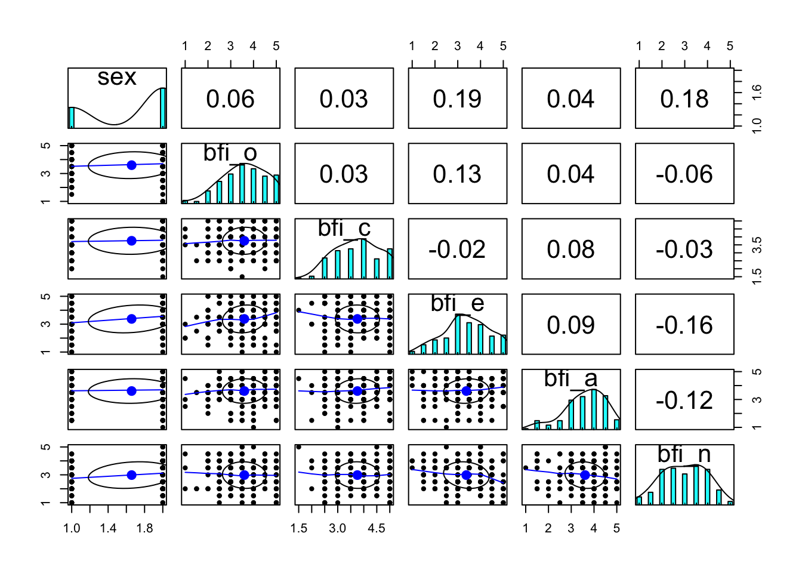

# Data, Descriptives & Data Viz {#data-descriptives-dataviz}

This tutorial walks through a few helpful initial steps before analysis of experience sampling and EMA data (or any analyses, actually).

## Outline

This chapter covers ...

A. Loading the AMIB data

B. Describing some aspects of the data

C. A few data visualizations

### Loading Libraries Used in this Script


``` r
library(psych)      #describing the data
library(tidyr)      #tidy data
library(dplyr)      #data manipulation
library(ggplot2)    #data visualization

#you can load tidyverse (dplyr, forcats, ggplot2, lubridate, purr, rear, stringr, tibble, tidyr) via:
#library(tidyverse)
#we do this in lots of our tutorials and in our own work!
```

**If you have issues installing the psych package - try installing the psych package again without compilation**

## Loading The AMIB Data

The first step, and often the most frustrating part of data analysis is...getting the data into the program!

In recent years people are generally exchanging data files in a .csv format as these files port well and can interface with many different software packages.

Here, we make use of the person-level and interaction-level (EMA-type) AMIB data files, which can be merged easily using the `id` and `day` variables.

### Loading person-level file (*N* = 190)


``` r
#set filepath for data file
filepath <- "https://raw.githubusercontent.com/The-Change-Lab/collaborations/main/AMIB/AMIB_persons.csv"
#read in the .csv file using the url() function
AMIB_persons <- read.csv(file=url(filepath), header=TRUE)
```

### Loading interaction-level file (*T* = many, on average 43 per person)


``` r
#set filepath for data file
filepath <- "https://raw.githubusercontent.com/The-Change-Lab/collaborations/main/AMIB/AMIB_interaction.csv"
#read in the .csv file using the url() function
AMIB_interaction <- read.csv(file=url(filepath), header=TRUE)
```

## Describing The AMIB Data

Once the data are in, we can begin learning about them.

### Basic descriptives of person-level data

#### Subsetting to a few variables


``` r
#subsetting to a few trait variables
AMIB_persons <- AMIB_persons %>%
  select(id, sex, bfi_o, bfi_c, bfi_e, bfi_a, bfi_n)
#note, subsetting with the same name will override the original data that you loaded, and you'll loose the variables you don't select
#if you don't want to loose those variables, subset to a new data frame, ie: AMIB_persons_sub <- AMIB_persons
```

### Descriptives of traits using person-level data (sex, personality)


``` r
#basic descriptives (using describe() from the psych package)
psych::describe(AMIB_persons)
#>       vars   n   mean     sd median trimmed    mad   min
#> id       1 190 318.29 130.44  321.5  318.99 151.23 101.0
#> sex      2 190   1.66   0.48    2.0    1.70   0.00   1.0
#> bfi_o    3 190   3.60   0.96    3.5    3.64   0.74   1.0
#> bfi_c    4 190   3.76   0.85    4.0    3.77   0.74   1.5
#> bfi_e    5 190   3.38   1.00    3.5    3.40   0.74   1.0
#> bfi_a    6 190   3.61   0.88    3.5    3.69   0.74   1.0
#> bfi_n    7 190   2.98   0.96    3.0    3.00   1.48   1.0
#>       max range  skew kurtosis   se
#> id    532 431.0 -0.04    -1.09 9.46
#> sex     2   1.0 -0.66    -1.57 0.03
#> bfi_o   5   4.0 -0.34    -0.48 0.07
#> bfi_c   5   3.5 -0.12    -0.90 0.06
#> bfi_e   5   4.0 -0.21    -0.58 0.07
#> bfi_a   5   4.0 -0.72     0.14 0.06
#> bfi_n   5   4.0 -0.09    -0.82 0.07
#note: some psych and dplyr functions overlap. You have to specify your package by package::function(data)

#correlations
cor(AMIB_persons[ ,-1]) #dropping 1st column (id)
#>              sex       bfi_o       bfi_c       bfi_e
#> sex   1.00000000  0.06161000  0.03394367  0.18873546
#> bfi_o 0.06161000  1.00000000  0.03093131  0.13087435
#> bfi_c 0.03394367  0.03093131  1.00000000 -0.01870259
#> bfi_e 0.18873546  0.13087435 -0.01870259  1.00000000
#> bfi_a 0.04422936  0.03581446  0.08472053  0.08558411
#> bfi_n 0.18389358 -0.05557229 -0.02838956 -0.16160302
#>             bfi_a       bfi_n
#> sex    0.04422936  0.18389358
#> bfi_o  0.03581446 -0.05557229
#> bfi_c  0.08472053 -0.02838956
#> bfi_e  0.08558411 -0.16160302
#> bfi_a  1.00000000 -0.12293379
#> bfi_n -0.12293379  1.00000000

#plot matrix (usingpairs.panels from the psych package)
psych::pairs.panels(AMIB_persons[ ,-1])
```



Note that the person-level descriptives are "cross-sectional".

### Basic descriptives of interaction-level data

Subsetting to a few variables:

-   ID and TIME variables: `id`, `day`, `interaction`, `timea`

-   Outcome variables: `partner_gender`, `agval`, `stress`


``` r
#subsetting to a few variables
AMIB_interaction <- AMIB_interaction %>%
  select(id, day, interaction, timea, partner_gender, agval, stress)
```

Often, our analyses will make use of both the repeated measures data and the person-level data.
For illustration, we merge them here.

### Merging person-level data into repeated measures interaction-level data


``` r
#merging repeated measures and person-level data
interaction_long <- AMIB_interaction %>%
  left_join(AMIB_persons, by="id")

#look at first few rows of data
head(interaction_long, 10)
#>     id day interaction timea partner_gender agval stress
#> 1  101   1           1   700              0     3      1
#> 2  101   1           2  1230              1     8      1
#> 3  101   1           3  1245              1     8      1
#> 4  101   1           4  1330              1     8      1
#> 5  101   1           5  1420              1     6      1
#> 6  101   1           6  1445              1     8      1
#> 7  101   1           7  1920              1     8      1
#> 8  101   1           8  2030              1     8      1
#> 9  101   2           9    30              0     9      0
#> 10 101   2          10     0              1     8      0
#>    sex bfi_o bfi_c bfi_e bfi_a bfi_n
#> 1    2     4     4   3.5   1.5     2
#> 2    2     4     4   3.5   1.5     2
#> 3    2     4     4   3.5   1.5     2
#> 4    2     4     4   3.5   1.5     2
#> 5    2     4     4   3.5   1.5     2
#> 6    2     4     4   3.5   1.5     2
#> 7    2     4     4   3.5   1.5     2
#> 8    2     4     4   3.5   1.5     2
#> 9    2     4     4   3.5   1.5     2
#> 10   2     4     4   3.5   1.5     2

#checking number of persons
length(unique(interaction_long$id))
#> [1] 184
```

Note that there are only 184 persons in the data now (vs. *N* = 190 in the person-level file).

In this case, the discrepancy is because there were 6 persons that completed baseline questionnaires, but did not provide any EMA data.

### Descriptives of the merged interaction-level and person-level data


``` r
#basic descriptives
psych::describe(interaction_long)
#>                vars    n    mean     sd median trimmed
#> id                1 7568  330.55 122.47  328.0  334.09
#> day               2 7568    3.97   1.99    4.0    3.96
#> interaction       3 7568   23.31  14.74   22.0   22.56
#> timea             4 7500 1496.82 445.29 1500.0 1495.34
#> partner_gender    5 6884    0.60   0.49    1.0    0.62
#> agval             6 7553    6.68   1.96    7.0    6.92
#> stress            7 7544    1.31   1.33    1.0    1.14
#> sex               8 7568    1.70   0.46    2.0    1.75
#> bfi_o             9 7568    3.60   0.95    3.5    3.64
#> bfi_c            10 7568    3.77   0.85    4.0    3.79
#> bfi_e            11 7568    3.41   0.97    3.5    3.43
#> bfi_a            12 7568    3.61   0.87    3.5    3.69
#> bfi_n            13 7568    3.00   0.96    3.0    3.00
#>                   mad   min  max  range  skew kurtosis   se
#> id             145.29 101.0  532  431.0 -0.17    -0.91 1.41
#> day              2.97   1.0    7    6.0  0.02    -1.24 0.02
#> interaction     17.79   1.0   56   55.0  0.35    -0.90 0.17
#> timea          489.26   0.0 2800 2800.0 -0.10    -0.14 5.14
#> partner_gender   0.00   0.0    1    1.0 -0.39    -1.85 0.01
#> agval            1.48   1.0    9    8.0 -0.95     0.33 0.02
#> stress           1.48   0.0    5    5.0  0.77    -0.32 0.02
#> sex              0.00   1.0    2    1.0 -0.85    -1.27 0.01
#> bfi_o            0.74   1.0    5    4.0 -0.41    -0.24 0.01
#> bfi_c            0.74   1.5    5    3.5 -0.15    -0.86 0.01
#> bfi_e            0.74   1.0    5    4.0 -0.24    -0.52 0.01
#> bfi_a            0.74   1.0    5    4.0 -0.65    -0.02 0.01
#> bfi_n            1.48   1.0    5    4.0 -0.03    -0.76 0.01

#plot matrix
psych::pairs.panels(interaction_long[ ,c("partner_gender","agval","stress")])
```


**BE CAREFUL!**

These descriptives ignore the nesting of the data (i.e., they are a mix of within-person and between-person information).

### Describing compliance (and missing data)

Among the first steps when describing experience sampling data is describing the number of observations.
*The protocol was designed for 8 reports per day for 7 days = 56 observations maximum per person.*


``` r
# counts of days (day 0 to day 8) completed
table(interaction_long$day)
#> 
#>    1    2    3    4    5    6    7 
#> 1101 1094 1071 1128 1055 1076 1043

#counting number of days and interaction reports completed for each person
compliance_stats <- interaction_long %>%
  group_by(id) %>%   #specify the unit we want to summarise by, in this case per person
  summarise(num_days = length(unique(day)),
            num_obs = length(id))

# looking at counts
describe(compliance_stats)
#>          vars   n   mean     sd median trimmed    mad min
#> id          1 184 321.97 129.72  323.5  323.39 151.23 101
#> num_days    2 184   6.82   0.64    7.0    6.99   0.00   2
#> num_obs     3 184  41.13  13.62   43.0   42.45  17.79  10
#>          max range  skew kurtosis   se
#> id       532   431 -0.07    -1.09 9.56
#> num_days   7     5 -4.66    25.30 0.05
#> num_obs   56    46 -0.53    -0.94 1.00
table(compliance_stats$num_days, useNA = "always")
#> 
#>    2    3    4    5    6    7 <NA> 
#>    1    1    1    5   11  165    0
table(compliance_stats$num_obs, useNA = "always")
#> 
#>   10   11   13   14   15   16   17   18   19   20   22   23 
#>    2    1    1    2    2    3    1    4    2    2    1    5 
#>   25   26   28   29   30   31   32   33   34   35   36   37 
#>    5    2    4    4    4    6    2    4    6    3    3    2 
#>   38   39   40   41   42   43   44   45   46   47   48   49 
#>    1    2    3    5    5    6    2    4    3    4    6    2 
#>   50   51   52   53   54   55   56 <NA> 
#>    5    6    4    2    2    7   44    0

#histogram
compliance_stats %>%
  ggplot(aes(x = num_obs)) +
  geom_histogram(fill="white", color="black") + 
  labs(x = "Number of Observations Completed")
```


Note that the specific way one does these counts depends on the structure of the initial data file - e.g., whether missed reports included or not (here they were not).
The counts can then be summarized for inclusion in a report.

### Long and Wide Format Data

Behavioral science tends to use relational data structures - i.e., spreadsheets.
Typically the data are stored/configured as a data frame (a “fancy” matrix) with multiple rows and multiple columns.

Two main schema are used to accommodate repeated measures data: “Wide Format” and “Long Format”.

Different functions work with different kinds of data formats.
Thus, it is imperative that one can convert the data back and forth between wide and long formats.

#### Reshape the data from ***Long*** to ***Wide***

There are lots of ways to go from long to wide or wide to long.

With the popularity of tidyverse, `pivot_wider` and `pivot_longer` are taking over for reshaping.
Tidyverse has a good guide for `pivot_wider` [here](https://tidyr.tidyverse.org/reference/pivot_wider.html) and for `pivot_longer` [here](https://tidyr.tidyverse.org/reference/pivot_longer.html).

Older popular functions include the `reshape()` function (not to be confused with the reshape2 package) and `melt()` and `cast()` functions in the reshape2 package.


``` r
#trick to get variable names for easy cut-and-paste
dput(names(interaction_long))
#> c("id", "day", "interaction", "timea", "partner_gender", "agval", 
#> "stress", "sex", "bfi_o", "bfi_c", "bfi_e", "bfi_a", "bfi_n")

#reshaping long to wide (using tidyr package)
interaction_wide <-interaction_long %>%
  select(-day) %>% #dropping variables not needed
  rename(partnergender = partner_gender) %>% #renaming to make reshaping easier later
  pivot_wider(id_cols = c(id, sex, bfi_o, bfi_c, bfi_e, bfi_a, bfi_n), #column(s) to keep as is
              names_from = interaction, #column(s) by which to pivot
              values_from = c(timea, partnergender, agval, stress), #column(s) that you want to pivot wider
              names_sep = "_")

#looking at part of data file
head(interaction_wide[,1:10], 10)
#> # A tibble: 10 × 10
#>       id   sex bfi_o bfi_c bfi_e bfi_a bfi_n timea_1 timea_2
#>    <int> <int> <dbl> <dbl> <dbl> <dbl> <dbl>   <int>   <int>
#>  1   101     2   4     4     3.5   1.5   2       700    1230
#>  2   103     2   5     3.5   4     4.5   2.5    1100    1400
#>  3   104     2   3     4.5   3     4.5   2.5     700     530
#>  4   105     2   4.5   3     3.5   3.5   3.5    1100    1210
#>  5   106     2   3     5     3     3.5   1.5    1100    1330
#>  6   107     1   4     5     5     4     1.5    1110    1210
#>  7   108     2   3     5     3.5   3     4.5    1327    1348
#>  8   109     1   3     3     3.5   3     4      1115    1145
#>  9   110     2   5     3.5   3     3.5   3.5    1010    1230
#> 10   111     1   2     3     3     3.5   3.5     930    1200
#> # ℹ 1 more variable: timea_3 <int>
```

*Note that the interaction_wide data has 184 rows, and that NAs have been filled in for those with less than 56 reports.*

#### Reshape the data from *Wide* to *Long*


``` r
#reshaping long to wide (using tidyr package)
interaction_long_NEW <-interaction_wide %>%
  pivot_longer(!c(id, sex, bfi_o, bfi_c, bfi_e, bfi_a, bfi_n), #column(s) that you want to keep the same
               #when calling an existing column, as in the line above, quotation marks are NOT needed
               names_to = c("variable", "interaction"), #variables to create
               #when naming a new column, as in "names_to" above, quotation marks ARE needed
               names_sep = "_", #what character separates the column names
               values_to = "value")

interaction_long_NEW <-interaction_long_NEW %>%
  pivot_wider(id_cols = c(id, sex, bfi_o, bfi_c, bfi_e, bfi_a, bfi_n, interaction),
              names_from = "variable", #column(s) to pivot by,
              values_from = "value")
#Note, while this pivot can be done in one step, it's common to use multiple pivots to get the data in the exact shape you want. 
#It's good practice to check along the way how your data is structured. 

#looking at part of data file
head(interaction_long_NEW, 10)
#> # A tibble: 10 × 12
#>       id   sex bfi_o bfi_c bfi_e bfi_a bfi_n interaction
#>    <int> <int> <dbl> <dbl> <dbl> <dbl> <dbl> <chr>      
#>  1   101     2     4     4   3.5   1.5     2 1          
#>  2   101     2     4     4   3.5   1.5     2 2          
#>  3   101     2     4     4   3.5   1.5     2 3          
#>  4   101     2     4     4   3.5   1.5     2 4          
#>  5   101     2     4     4   3.5   1.5     2 5          
#>  6   101     2     4     4   3.5   1.5     2 6          
#>  7   101     2     4     4   3.5   1.5     2 7          
#>  8   101     2     4     4   3.5   1.5     2 8          
#>  9   101     2     4     4   3.5   1.5     2 9          
#> 10   101     2     4     4   3.5   1.5     2 10         
#> # ℹ 4 more variables: timea <dbl>, partnergender <dbl>,
#> #   agval <dbl>, stress <dbl>
```

*Note that the interaction_long_NEW data has 10304 rows, whereas the original data interaction_long had only 7568 rows. This is because NAs were filled in for all of those persons with less than 56 reports.*

**BE CAREFUL WITH RESHAPE** **THE ARGUMENTS NEEDED ARE NOT ALWAYS STRAIGHTFORWARD.**

Be sure that the missing data (NAs) have been handled in the intended way.

## Data Visualization

There are lots of ways to visualize repeated measures data.
We encourage you to engage in lots of data visualization and learn as much about the data as possible.
Here we provide just a few useful time-series oriented plots using the `ggplot()` functions in the [ggplot2 package](https://ggplot2.tidyverse.org/).

### Plotting one variable over time for all persons.


``` r
# plotting intraindividual change 
interaction_long %>%
  ggplot(aes(x=interaction, y=agval, group=id, color=factor(id))) +
  guides(color="none") + # to suppress guide
  # first variable
  geom_line() +
  # plot layouts
  scale_x_continuous(breaks=c(0,8,16,24,32,40,48,56), name="Interaction") +
  scale_y_continuous(breaks=c(1,3,5,7,9), name="Affect Valence") +  
  ggtitle("Intraindividual Variability\nAcross Social Interactions (N=184)") +
  theme_classic() +
  theme(axis.title=element_text(size=14),
        axis.text=element_text(size=14),
        plot.title=element_text(size=14, hjust=.5))
```


That "blob" is not very informative.
Better to consider a subset of persons or to consider *intraindividual* plots - how each individual person changes over time.

### Plotting one variable over time for subset of persons


``` r
# plotting intraindividual change 
interaction_long %>%
  filter(id < 112) %>% #filter for ids 101-111
  ggplot(aes(x=interaction, group=id), color=factor(id)) +
  guides(color="none") + #to suppress guide
  # first variable
  geom_line(aes(y=agval, color=factor(id))) +
  # plot layouts
  scale_x_continuous(breaks=c(0,8,16,24,32,40,48,56), name="Interaction") +
  scale_y_continuous(breaks=c(1,3,5,7,9), name="Affect Valence") +  
  ggtitle("Intraindividual Variability\nAcross Social Interactions (n=10)") +
  theme_classic() +
  theme(axis.title=element_text(size=14),
        axis.text=element_text(size=14),
        plot.title=element_text(size=14, hjust=.5))
```


Now move on to *intraindividual* plots

### Plotting two variables for one person


``` r
#set colors
cols <- c("Affect Valence"="#F27781", "Stress"="#18298C")
#plotting intraindividual change 
interaction_long %>%
  filter(id == 104) %>%
  ggplot(aes(x=interaction, group= id)) +
  # first variable
  geom_line(aes(y=agval, colour="Affect Valence")) +
  geom_point(aes(y=agval, colour="Affect Valence")) +
  # second variable
  geom_line(aes(y=stress, color="Stress")) +
  geom_point(aes(y=stress, color="Stress")) +
  # plot layouts
  scale_x_continuous(breaks=c(0,8,16,24,32,40,48,56), name="Social Interaction") +
  scale_y_continuous(breaks=c(0,2,4,6,8), name="Affect Valence & Stress") + 
  scale_color_manual(name="", values = cols) +
  ggtitle("Intraindividual Variability in Affect Valence and Stress\nAcross Social Interactions (n=1)") +
  theme_classic() +
  theme(axis.title=element_text(size=14),
        axis.text=element_text(size=14),
        plot.title=element_text(size=14, hjust=.5),
        legend.text=element_text(size=14))
```


Line plots are good for continuous variables.
Note however, that the scales for these two variables do overlap, but are not exactly the same.

### Including a categorical variable.

We can effectively use the background to display categorical variables using the `geom_rect()` function within `ggplot()`.

### Plotting three variables for one person


``` r
#set colors
cols <- c("Affect Valence"="#F27781", "Stress"="#18298C")
#plotting intraindividual change 
interaction_long %>%
  filter(id == 104) %>%
  ggplot(aes(x=interaction, group=id)) +
  #categorical variable as background
  geom_rect(aes(xmin=interaction-.5, xmax=interaction+.5, ymin=0, ymax=10,
                fill=factor(partner_gender)), alpha=0.2) +
  # first variable
  geom_line(aes(y=agval, colour="Affect Valence")) +
  geom_point(aes(y=agval, colour="Affect Valence")) +
  # second variable
  geom_line(aes(y=stress, color="Stress")) +
  geom_point(aes(y=stress, color="Stress")) +
  # plot layouts
  scale_color_manual(name="", values = cols) +
  scale_fill_manual(name = "Partner Gender",
                    values = c("#F29E03", "#20BDA1"), 
                    labels = c("female", "male", "missing"),
                    na.value="black") + 
  scale_x_continuous(breaks=c(0,8,16,24,32,40,48,56), name="Social Interaction") +
  scale_y_continuous(breaks=c(0,2,4,6,8), name="Affect Valence & Stress") + 
  ggtitle("Intraindividual Variability in Affect Valence and Stress\nAcross Social Interactions with Male and Female Partners (n=1)") +
  theme_classic() +
  theme(axis.title=element_text(size=14),
        axis.text=element_text(size=14),
        plot.title=element_text(size=14, hjust=.5))
```


### Plotting multiple individuals

Of course, we are also interested in interindividual differences.
To examine those, we can display multiple persons in separate panels using `facet_wrap()`.


``` r
# plotting intraindividual change 
interaction_long %>%
  filter(id <= 106) %>%
  ggplot(aes(x = interaction, group= factor(id))) +
  geom_line(aes(y=agval), colour="#F27781") +
  geom_point(aes(y=agval), colour="#F27781") +
  scale_x_continuous(breaks=c(0,8,16,24,32,40,48,56), name="Social Interaction") +
  scale_y_continuous(breaks=c(1,3,5,7,9), name="Affect Valence") + 
  ggtitle("Intraindividual Variability in Affect Valence\nAcross Social Interactions (n=5)") +
  theme_classic() +
  theme(axis.title=element_text(size=14),
        axis.text=element_text(size=14),
        plot.title=element_text(size=14, hjust=.5)) +
  facet_wrap(~id, nrow=5)
```


``` r
#set colors
cols <- c("Affect Valence"="#F27781", "Stress"="#18298C")
#plotting intraindividual change 
interaction_long %>%
  filter(id <= 106) %>%
  ggplot(aes(x = interaction, group= factor(id))) +
  geom_line(aes(y=agval, colour="Affect Valence")) +
  geom_point(aes(y=agval, colour="Affect Valence")) +
  geom_line(aes(y=stress, color="Stress")) +
  geom_point(aes(y=stress, color="Stress")) +
  scale_x_continuous(breaks=c(0,8,16,24,32,40,48,56), name="Social Interaction") +
  scale_y_continuous(breaks=c(0,4,8), name="Affect Valence & Stress") + 
  scale_color_manual(name="", values = cols) +
  ggtitle("Intraindividual Variability in Affect Valence and Stress\nAcross Social Interactions (n=5)") +
  theme_classic() +
  theme(axis.title=element_text(size=14),
        axis.text=element_text(size=14),
        plot.title=element_text(size=14, hjust=.5),
        legend.text=element_text(size=14)) +
  facet_wrap(~id, nrow=5)
```


``` r
#set colors
cols <- c("Affect Valence"="#F27781", "Stress"="#18298C")
#plotting intraindividual change 
interaction_long %>%
  filter(id <= 106) %>%
  ggplot(aes(x = interaction, group= factor(id))) +
  #categorical variable as background
  geom_rect(aes(xmin=interaction-.5, xmax=interaction+.5, ymin=0, ymax=9,
                fill=factor(partner_gender)), alpha=0.2) +
  #first variable
  geom_line(aes(y=agval, colour="Affect Valence")) +
  geom_point(aes(y=agval, colour="Affect Valence")) +
  #second variable
  geom_line(aes(y=stress, color="Stress")) +
  geom_point(aes(y=stress, color="Stress")) +
  #plot layouts
  scale_color_manual(name="", values = cols) +
  scale_fill_manual(name = "Partner Gender",
                    values = c("#F29E03", "#20BDA1"), 
                    labels = c("female", "male", "missing"),
                    na.value="black") + 
  scale_x_continuous(breaks=c(0,8,16,24,32,40,48,56), name="Social Interaction") +
  scale_y_continuous(breaks=c(0,2,4,6,8), name="Affect Valence & Stress") +  
  ggtitle("Intraindividual Variability in Affect Valence and Stress\nAcross Social Interactions with Male and Female Partners (n=1)") +
  theme_classic() +
  theme(axis.title=element_text(size=14),
        axis.text=element_text(size=14),
        plot.title=element_text(size=14, hjust=.5)) +
  facet_wrap(~id, nrow=5)
```


## Conclusion

This tutorial covered some basics, including reading in repeated measures data from an experience sampling study, manipulating those data into two different structures (long and wide), assessing the overall characteristics of the data/protocol, and describing the data (descriptives and plots).

We hope this foundational material prompts development of some general strategies that can be applied whenever approaching new longitudinal data.
The best part is that, after looking at the above plots, we know that subsequent analyses will be super fun!

**Thanks for playing!**

## Captioned figures and tables

Figures and tables *with captions* can also be cross-referenced from elsewhere in your book using `\@ref(fig:chunk-label)` and `\@ref(tab:chunk-label)`, respectively.

See Figure \@ref(fig:nice-fig).


``` r
par(mar = c(4, 4, .1, .1))
plot(pressure, type = 'b', pch = 19)
```

<div class="figure" style="text-align: center">

<p class="caption">(\#fig:nice-fig)Here is a nice figure!</p>
</div>

Don't miss Table \@ref(tab:nice-tab).


``` r
knitr::kable(
  head(pressure, 10), caption = 'Here is a nice table!',
  booktabs = TRUE
)
```


Table: (\#tab:nice-tab)Here is a nice table!

| temperature| pressure|
|-----------:|--------:|
|           0|   0.0002|
|          20|   0.0012|
|          40|   0.0060|
|          60|   0.0300|
|          80|   0.0900|
|         100|   0.2700|
|         120|   0.7500|
|         140|   1.8500|
|         160|   4.2000|
|         180|   8.8000|


